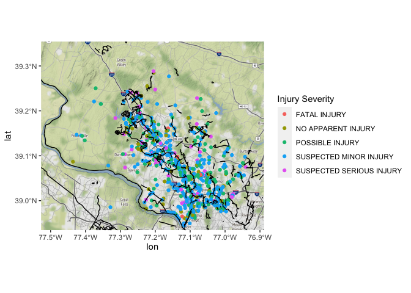

Bike Incidents & Existing Lanes
================

# Packages & Data

``` r
library(tidyverse)
library(ggmap)
library(osmdata)
library(tidyverse)
library(sp)
library(sf)
library(ggspatial)
library(ggmap)
library(writexl)

load("data/bike_data.RData")
```

# Visualizaing

``` r
map2 <- get_map(location = moco_bb)

ggmap(map2) +
  geom_point(data = bike_incidents, aes(x = Longitude, y = Latitude, color = `Injury Severity`)) +
  layer_spatial(cycleways)
```

<!-- -->
