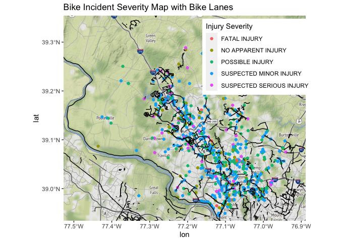
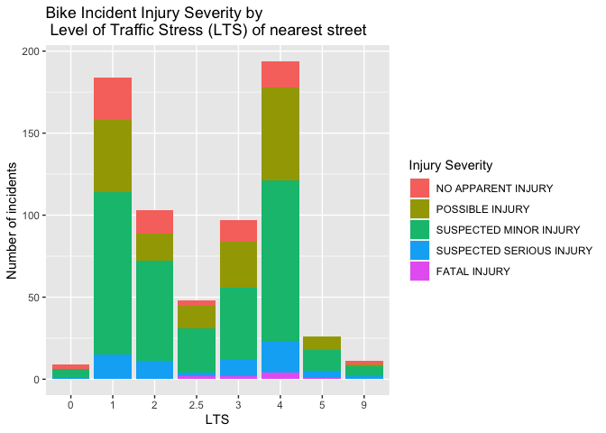

Bike Incidents & Existing Lanes
================

# Packages & Data

``` r
library(tidyverse)
library(ggmap)
library(ggspatial)
library(tidyverse)
library(sf)
library(geosphere)
library(readxl)

load("data/bike_data.RData")
```

# Visualizaing

``` r
map2 <- get_map(location = moco_bb)

ggmap(map2) +
  geom_point(data = bike_incidents, aes(x = Longitude, y = Latitude, color = `Injury Severity`)) +
  layer_spatial(osm_bike$osm_lines$geometry) + 
  labs(title = "Bike Incident Severity Map with Bike Lanes") +
  theme(legend.position = c(0.8,0.8))
```

<!-- -->

``` r
ggsave("incidents_cycleways.png", width = 9, height = 9, units = "in")
```

# Find road lenghts

This makes the assumption that if a cycleway (bike lane or trail)
exists, the cyclist was using it.

``` r
# Length of road data (for incident per mile calculation)
streets <- as(osm_streets$osm_lines,"SpatialLinesDataFrame")

streets_df <- data.frame(streets@data)


#Each road has multiple segments on our list because its characteristics can change
#loop through each to find all the segment ids, then add up all the segment lengths

road_lengths <- NULL

for (i in matched_streets$osm_name) {

street <- streets_df %>%
  filter(toupper(name) == i) 

road_length <- 0

  for (j in street$osm_id)  {

  x <- paste0("streets@lines$`",j,"`@Lines")

  segment <- lengthLine(eval(parse(text = x))[[1]]@coords)

  road_length <- road_length + segment

  
  }
  road_name <- street$name
  road_df <- data.frame(road_name,road_length)
  road_lengths <- bind_rows(road_lengths,road_df)

}

#it worked but there's a row for each segment instead of a row for each street. Also need to convert to miles.

road_lengths <- road_lengths %>%
  distinct() %>%
  mutate(road_length = road_length * 0.00062137,
         road_name = toupper(road_name)) %>%
  rename(osm_name = road_name)

matched_streets <- matched_streets %>%
  inner_join(road_lengths) %>%
  mutate(incidents_per_mile = n / road_length,
         incidents_per_mile_annual = incidents_per_mile / 4)
```

    ## Joining, by = c("osm_name", "road_length")

``` r
#which streets have the highest accident rate?

accident_rate <- matched_streets %>%
  select(osm_name,moco_name,n,road_length,incidents_per_mile,incidents_per_mile_annual) %>%
  arrange(desc(incidents_per_mile_annual)) 

#lets filter out roads with 3 or fewer accidents just to focus on places that are higher impact

accident_rate_trimmed <- accident_rate %>%
  filter(n >= 3)

head(accident_rate_trimmed)
```

    ## # A tibble: 6 x 6
    ##   osm_name     moco_name       n road_length incidents_per_m… incidents_per_mil…
    ##   <chr>        <chr>       <dbl>       <dbl>            <dbl>              <dbl>
    ## 1 DORSET AVEN… DORSET AVE      7       1.25              5.59              1.40 
    ## 2 STEDWICK RO… STEDWICK RD     5       1.50              3.33              0.833
    ## 3 FENTON STRE… FENTON ST       4       1.25              3.21              0.801
    ## 4 LITTLE FALL… LITTLE FAL…     8       2.50              3.20              0.799
    ## 5 ARDENNES AV… ARDENNES A…     3       0.950             3.16              0.789
    ## 6 WOODMONT AV… WOODMONT A…     4       1.50              2.67              0.669

# EDA of joined incident and LTS data

Used QGIS and the NNJoin plugin to join the LTS data to the Crash
Reporting dataset; each incident has been joined to the characteristics
of the nearest road segment.

[LTS
Methodology](https://montgomeryplanning.org/wp-content/uploads/2017/11/Appendix-D.pdf)

Revised LTS Key: - LTS 0 – None (separated trails and breezeways)  
- LTS 1 – Very Low (Neighborhood roads, suitable for children)  
- LTS 2 – Low (“suitable for most adults”)  
- LTS 2.5 – Moderate Low  
- LTS 3 – Moderate High (four lane road with bike lane)  
- LTS 4 – High (&gt;40mph road)  
- LTS 5 – Very High (“few bicyclists will brave these roads”)  
- LTS 9 - (not defined in methodology document; appears to be
freeways/ramps. Accidents reported on these roads are n=11, 9 of which
are labeled as at crossings)  
- TRANS - (not defined in methodology document; appears to be Transit
station related?)  
- P - (not defined in methodology document; appears to be parking lots)

``` r
joined_lts_crash <- read_excel("data/joined_lts_crash.xlsx")

#The `distance` column is distance to nearest neighbor; let's remove those that are distant from any given street, allowing for GPS imprecision 

joined_lts_crash_filtered <- joined_lts_crash %>%
  filter(distance < 50) %>%
  filter(!is.na(join_LTS_REV)) %>%
  filter(join_LTS_REV != "TRANS") %>%
  filter(join_LTS_REV != "P")

order <- c("NO APPARENT INJURY",
           "POSSIBLE INJURY",
           "SUSPECTED MINOR INJURY",
           "SUSPECTED SERIOUS INJURY",
           "FATAL INJURY")

joined_lts_crash_filtered$`Injury Severity` <- factor(joined_lts_crash_filtered$`Injury Severity`,levels = order)
```

## LTS by incident severity

``` r
ggplot(joined_lts_crash_filtered,aes(x=join_LTS_REV,fill=`Injury Severity`)) +
  geom_bar() +
  labs(title="Bike Incident Injury Severity by \n Level of Traffic Stress (LTS) of nearest street",
       x="LTS",
       y="Number of incidents",
       fill="Injury Severity")
```

<!-- -->

## Injury Severity by other road characteristics

``` r
ggplot(joined_lts_crash_filtered,aes(x=join_AVG_SLOPE,y=`Injury Severity`)) +
  geom_boxplot() +
  geom_jitter(alpha = 0.1) +
  labs(title = "Injury Severity by \n Average Slope of road segment",
       x = "Average Slope",
       y = "Injury Severity")
```

<!-- -->

``` r
ggplot(joined_lts_crash_filtered,aes(x=as.double(join_SPEEDLIM),y=`Injury Severity`)) +
  geom_boxplot()  +
  geom_jitter(alpha = 0.1) +
  labs(title = "Injury Severity by \n speed limit of road segment",
       x = "Speed Limit",
       y = "Injury Severity")
```

    ## Warning in FUN(X[[i]], ...): NAs introduced by coercion

    ## Warning in FUN(X[[i]], ...): NAs introduced by coercion

    ## Warning in FUN(X[[i]], ...): NAs introduced by coercion

    ## Warning: Removed 26 rows containing non-finite values (stat_boxplot).

    ## Warning: Removed 26 rows containing missing values (geom_point).

<!-- -->

``` r
ggplot(joined_lts_crash_filtered,aes(x=as.double(join_BKLNWIDTH),y=`Injury Severity`)) +
  geom_jitter(alpha=0.3,shape = 16) +
  labs(title = "Injury Severity by \n Bike Lane Width of road segment",
       x = "Bike Lane Width (in feet) \n (0 means no bike lane)",
       y = "Injury Severity")
```

<!-- -->

# Association of Incident Severity and LTS

Since we don’t have traffic data, we can’t make assumptions about the
impact of LTS on incident rate - we just don’t have the denominator. We
*can* make assumptions about incident severity.

``` r
#contingency table of LTS vs injury severity
table(joined_lts_crash_filtered$join_LTS_REV,joined_lts_crash_filtered$`Injury Severity`)
```

    ##      
    ##       NO APPARENT INJURY POSSIBLE INJURY SUSPECTED MINOR INJURY
    ##   0                    3               0                      5
    ##   1                   26              44                     99
    ##   2                   14              17                     61
    ##   2.5                  3              14                     27
    ##   3                   13              28                     44
    ##   4                   16              57                     98
    ##   5                    0               8                     13
    ##   9                    2               1                      6
    ##      
    ##       SUSPECTED SERIOUS INJURY FATAL INJURY
    ##   0                          1            0
    ##   1                         15            0
    ##   2                         11            0
    ##   2.5                        2            2
    ##   3                         10            2
    ##   4                         19            4
    ##   5                          4            1
    ##   9                          2            0

``` r
#distribution, row-wise
prop.table(table(joined_lts_crash_filtered$join_LTS_REV,joined_lts_crash_filtered$`Injury Severity`), margin = 1)
```

    ##      
    ##       NO APPARENT INJURY POSSIBLE INJURY SUSPECTED MINOR INJURY
    ##   0           0.33333333      0.00000000             0.55555556
    ##   1           0.14130435      0.23913043             0.53804348
    ##   2           0.13592233      0.16504854             0.59223301
    ##   2.5         0.06250000      0.29166667             0.56250000
    ##   3           0.13402062      0.28865979             0.45360825
    ##   4           0.08247423      0.29381443             0.50515464
    ##   5           0.00000000      0.30769231             0.50000000
    ##   9           0.18181818      0.09090909             0.54545455
    ##      
    ##       SUSPECTED SERIOUS INJURY FATAL INJURY
    ##   0                 0.11111111   0.00000000
    ##   1                 0.08152174   0.00000000
    ##   2                 0.10679612   0.00000000
    ##   2.5               0.04166667   0.04166667
    ##   3                 0.10309278   0.02061856
    ##   4                 0.09793814   0.02061856
    ##   5                 0.15384615   0.03846154
    ##   9                 0.18181818   0.00000000

``` r
#Test for independence
#Chi-squared test
chisq.test(table(joined_lts_crash_filtered$join_LTS_REV,joined_lts_crash_filtered$`Injury Severity`))
```

    ## Warning in chisq.test(table(joined_lts_crash_filtered$join_LTS_REV,
    ## joined_lts_crash_filtered$`Injury Severity`)): Chi-squared approximation may be
    ## incorrect

    ## 
    ##  Pearson's Chi-squared test
    ## 
    ## data:  table(joined_lts_crash_filtered$join_LTS_REV, joined_lts_crash_filtered$`Injury Severity`)
    ## X-squared = 36.449, df = 28, p-value = 0.1315

``` r
#p = 0.1315, but too many values of <5 for the results to be valid

#Fishers test
#Uses monte carlo simulation when the contingency table is larger than 2x2 (simulate.p.value = T), which also means we can't get confidence intervals out of it.
fisher.test(joined_lts_crash_filtered$join_LTS_REV,joined_lts_crash_filtered$`Injury Severity`,simulate.p.value = T)
```

    ## 
    ##  Fisher's Exact Test for Count Data with simulated p-value (based on
    ##  2000 replicates)
    ## 
    ## data:  joined_lts_crash_filtered$join_LTS_REV and joined_lts_crash_filtered$`Injury Severity`
    ## p-value = 0.04548
    ## alternative hypothesis: two.sided

``` r
# p = 0.04048 (will vary as seed changes)
#With p-values of <0.05, we can reject the null hypothesis and assume that these LTS and Injury Severity are associated 
```

Next, test some other associations

``` r
#weather - no association
fisher.test(joined_lts_crash_filtered$Weather,joined_lts_crash_filtered$`Injury Severity`,simulate.p.value = T)
```

    ## 
    ##  Fisher's Exact Test for Count Data with simulated p-value (based on
    ##  2000 replicates)
    ## 
    ## data:  joined_lts_crash_filtered$Weather and joined_lts_crash_filtered$`Injury Severity`
    ## p-value = 0.5222
    ## alternative hypothesis: two.sided

``` r
#light status (daylight, dawn, etc) - highly associated (p = 0.007) but n is very low
fisher.test(joined_lts_crash_filtered$Light,joined_lts_crash_filtered$`Injury Severity`,simulate.p.value = T)
```

    ## 
    ##  Fisher's Exact Test for Count Data with simulated p-value (based on
    ##  2000 replicates)
    ## 
    ## data:  joined_lts_crash_filtered$Light and joined_lts_crash_filtered$`Injury Severity`
    ## p-value = 0.003498
    ## alternative hypothesis: two.sided

``` r
#number of lanes - no association
fisher.test(joined_lts_crash_filtered$join_MP_LANES,joined_lts_crash_filtered$`Injury Severity`,simulate.p.value = T)
```

    ## 
    ##  Fisher's Exact Test for Count Data with simulated p-value (based on
    ##  2000 replicates)
    ## 
    ## data:  joined_lts_crash_filtered$join_MP_LANES and joined_lts_crash_filtered$`Injury Severity`
    ## p-value = 0.1154
    ## alternative hypothesis: two.sided

``` r
#speed limit - highly associated (p = 0.008) - expected as speed limit is a factor in LTS
fisher.test(joined_lts_crash_filtered$join_SPEEDLIM,joined_lts_crash_filtered$`Injury Severity`,simulate.p.value = T)
```

    ## 
    ##  Fisher's Exact Test for Count Data with simulated p-value (based on
    ##  2000 replicates)
    ## 
    ## data:  joined_lts_crash_filtered$join_SPEEDLIM and joined_lts_crash_filtered$`Injury Severity`
    ## p-value = 0.005997
    ## alternative hypothesis: two.sided

``` r
#shared road - no association
fisher.test(joined_lts_crash_filtered$join_MP_SHARDRD,joined_lts_crash_filtered$`Injury Severity`,simulate.p.value = T)
```

    ## 
    ##  Fisher's Exact Test for Count Data with simulated p-value (based on
    ##  2000 replicates)
    ## 
    ## data:  joined_lts_crash_filtered$join_MP_SHARDRD and joined_lts_crash_filtered$`Injury Severity`
    ## p-value = 0.8796
    ## alternative hypothesis: two.sided

``` r
#average slope - no association
fisher.test(joined_lts_crash_filtered$join_AVG_SLOPE,joined_lts_crash_filtered$`Injury Severity`,simulate.p.value = T)
```

    ## 
    ##  Fisher's Exact Test for Count Data with simulated p-value (based on
    ##  2000 replicates)
    ## 
    ## data:  joined_lts_crash_filtered$join_AVG_SLOPE and joined_lts_crash_filtered$`Injury Severity`
    ## p-value = 0.8661
    ## alternative hypothesis: two.sided

``` r
# to get a confidence interval we need to reduce the result (injury) to two levels: injury or no injury
simplified_injuries <- joined_lts_crash_filtered %>%
  mutate(injury = case_when(
    `Injury Severity` == "NO APPARENT INJURY" ~ "No injury",
    `Injury Severity` == "POSSIBLE INJURY" ~ "Injury",
    `Injury Severity` == "SUSPECTED MINOR INJURY" ~ "Injury",
    `Injury Severity` == "SUSPECTED SERIOUS INJURY" ~ "Injury",
    `Injury Severity` == "FATAL INJURY" ~ "Injury")) %>%
  select(join_LTS_REV,injury) %>%
  table()

simplified_injuries
```

    ##             injury
    ## join_LTS_REV Injury No injury
    ##          0        6         3
    ##          1      158        26
    ##          2       89        14
    ##          2.5     45         3
    ##          3       84        13
    ##          4      178        16
    ##          5       26         0
    ##          9        9         2

``` r
prop.test(simplified_injuries)
```

    ## Warning in prop.test(simplified_injuries): Chi-squared approximation may be
    ## incorrect

    ## 
    ##  8-sample test for equality of proportions without continuity
    ##  correction
    ## 
    ## data:  simplified_injuries
    ## X-squared = 13.473, df = 7, p-value = 0.06139
    ## alternative hypothesis: two.sided
    ## sample estimates:
    ##    prop 1    prop 2    prop 3    prop 4    prop 5    prop 6    prop 7    prop 8 
    ## 0.6666667 0.8586957 0.8640777 0.9375000 0.8659794 0.9175258 1.0000000 0.8181818

``` r
#this also uses chi-sq and still doesn't return a confidence interval
```

Try something different. Bring in accident rates on each street + avg
(mean?) LTS of those streets? Would need to convert LTS to an int;
remove P, TRANS, NA, etc.

(some manual cleaning done on xlsx, e.g. matching “1st St” to “FIRST
ST”)

``` r
LTS_streets <- read_excel("data/LTS.xlsx")
```

    ## Warning in read_fun(path = enc2native(normalizePath(path)), sheet_i = sheet, :
    ## Expecting logical in CM1435 / R1435C91: got 'BiPPA Silver Spring'

    ## Warning in read_fun(path = enc2native(normalizePath(path)), sheet_i = sheet, :
    ## Expecting logical in CM1803 / R1803C91: got 'BiPPA Silver Spring'

    ## Warning in read_fun(path = enc2native(normalizePath(path)), sheet_i = sheet, :
    ## Expecting logical in CM1938 / R1938C91: got 'BiPPA Silver Spring'

    ## Warning in read_fun(path = enc2native(normalizePath(path)), sheet_i = sheet, :
    ## Expecting logical in CM1939 / R1939C91: got 'BiPPA Silver Spring'

    ## Warning in read_fun(path = enc2native(normalizePath(path)), sheet_i = sheet, :
    ## Expecting logical in CM1981 / R1981C91: got 'BiPPA Silver Spring'

    ## Warning in read_fun(path = enc2native(normalizePath(path)), sheet_i = sheet, :
    ## Expecting logical in CM1982 / R1982C91: got 'BiPPA Silver Spring'

    ## Warning in read_fun(path = enc2native(normalizePath(path)), sheet_i = sheet, :
    ## Expecting logical in AW2447 / R2447C49: got '<Null>'

    ## Warning in read_fun(path = enc2native(normalizePath(path)), sheet_i = sheet, :
    ## Expecting logical in G3316 / R3316C7: got 'S'

    ## Warning in read_fun(path = enc2native(normalizePath(path)), sheet_i = sheet, :
    ## Expecting logical in G3592 / R3592C7: got 'S'

    ## Warning in read_fun(path = enc2native(normalizePath(path)), sheet_i = sheet, :
    ## Expecting logical in G3621 / R3621C7: got 'E'

    ## Warning in read_fun(path = enc2native(normalizePath(path)), sheet_i = sheet, :
    ## Expecting logical in G3637 / R3637C7: got 'E'

    ## Warning in read_fun(path = enc2native(normalizePath(path)), sheet_i = sheet, :
    ## Expecting logical in G3821 / R3821C7: got 'E'

    ## Warning in read_fun(path = enc2native(normalizePath(path)), sheet_i = sheet, :
    ## Expecting logical in DB4210 / R4210C106: got 'Rare'

    ## Warning in read_fun(path = enc2native(normalizePath(path)), sheet_i = sheet, :
    ## Expecting logical in G4345 / R4345C7: got 'S'

    ## Warning in read_fun(path = enc2native(normalizePath(path)), sheet_i = sheet, :
    ## Expecting logical in G4697 / R4697C7: got 'N'

    ## Warning in read_fun(path = enc2native(normalizePath(path)), sheet_i = sheet, :
    ## Expecting logical in G4756 / R4756C7: got 'E'

    ## Warning in read_fun(path = enc2native(normalizePath(path)), sheet_i = sheet, :
    ## Expecting logical in G4840 / R4840C7: got 'S'

    ## Warning in read_fun(path = enc2native(normalizePath(path)), sheet_i = sheet, :
    ## Expecting logical in G5361 / R5361C7: got 'N'

    ## Warning in read_fun(path = enc2native(normalizePath(path)), sheet_i = sheet, :
    ## Expecting logical in G5454 / R5454C7: got 'S'

    ## Warning in read_fun(path = enc2native(normalizePath(path)), sheet_i = sheet, :
    ## Expecting logical in G5974 / R5974C7: got 'N'

    ## Warning in read_fun(path = enc2native(normalizePath(path)), sheet_i = sheet, :
    ## Expecting logical in G5975 / R5975C7: got 'N'

    ## Warning in read_fun(path = enc2native(normalizePath(path)), sheet_i = sheet, :
    ## Expecting logical in G5991 / R5991C7: got 'N'

    ## Warning in read_fun(path = enc2native(normalizePath(path)), sheet_i = sheet, :
    ## Expecting logical in G6588 / R6588C7: got 'E'

    ## Warning in read_fun(path = enc2native(normalizePath(path)), sheet_i = sheet, :
    ## Expecting logical in DB6845 / R6845C106: got 'Rare'

    ## Warning in read_fun(path = enc2native(normalizePath(path)), sheet_i = sheet, :
    ## Expecting logical in G6949 / R6949C7: got 'E'

    ## Warning in read_fun(path = enc2native(normalizePath(path)), sheet_i = sheet, :
    ## Expecting logical in G7054 / R7054C7: got 'E'

    ## Warning in read_fun(path = enc2native(normalizePath(path)), sheet_i = sheet, :
    ## Expecting logical in G7152 / R7152C7: got 'E'

    ## Warning in read_fun(path = enc2native(normalizePath(path)), sheet_i = sheet, :
    ## Expecting logical in G7399 / R7399C7: got 'E'

    ## Warning in read_fun(path = enc2native(normalizePath(path)), sheet_i = sheet, :
    ## Expecting logical in G7458 / R7458C7: got 'E'

    ## Warning in read_fun(path = enc2native(normalizePath(path)), sheet_i = sheet, :
    ## Expecting logical in G7475 / R7475C7: got 'E'

    ## Warning in read_fun(path = enc2native(normalizePath(path)), sheet_i = sheet, :
    ## Expecting logical in G7513 / R7513C7: got 'E'

    ## Warning in read_fun(path = enc2native(normalizePath(path)), sheet_i = sheet, :
    ## Expecting logical in G7533 / R7533C7: got 'E'

    ## Warning in read_fun(path = enc2native(normalizePath(path)), sheet_i = sheet, :
    ## Expecting logical in G7551 / R7551C7: got 'E'

    ## Warning in read_fun(path = enc2native(normalizePath(path)), sheet_i = sheet, :
    ## Expecting logical in G7658 / R7658C7: got 'E'

    ## Warning in read_fun(path = enc2native(normalizePath(path)), sheet_i = sheet, :
    ## Expecting logical in G7694 / R7694C7: got 'E'

    ## Warning in read_fun(path = enc2native(normalizePath(path)), sheet_i = sheet, :
    ## Expecting logical in G7947 / R7947C7: got 'E'

    ## Warning in read_fun(path = enc2native(normalizePath(path)), sheet_i = sheet, :
    ## Expecting logical in G7952 / R7952C7: got 'E'

    ## Warning in read_fun(path = enc2native(normalizePath(path)), sheet_i = sheet, :
    ## Expecting logical in G7953 / R7953C7: got 'E'

    ## Warning in read_fun(path = enc2native(normalizePath(path)), sheet_i = sheet, :
    ## Expecting logical in G8099 / R8099C7: got 'E'

    ## Warning in read_fun(path = enc2native(normalizePath(path)), sheet_i = sheet, :
    ## Expecting logical in G8101 / R8101C7: got 'E'

    ## Warning in read_fun(path = enc2native(normalizePath(path)), sheet_i = sheet, :
    ## Expecting logical in G8143 / R8143C7: got 'E'

    ## Warning in read_fun(path = enc2native(normalizePath(path)), sheet_i = sheet, :
    ## Expecting logical in G8183 / R8183C7: got 'E'

    ## Warning in read_fun(path = enc2native(normalizePath(path)), sheet_i = sheet, :
    ## Expecting logical in G8533 / R8533C7: got 'E'

    ## Warning in read_fun(path = enc2native(normalizePath(path)), sheet_i = sheet, :
    ## Expecting logical in G8556 / R8556C7: got 'E'

    ## Warning in read_fun(path = enc2native(normalizePath(path)), sheet_i = sheet, :
    ## Expecting logical in G8674 / R8674C7: got 'E'

    ## Warning in read_fun(path = enc2native(normalizePath(path)), sheet_i = sheet, :
    ## Expecting logical in G8676 / R8676C7: got 'E'

    ## Warning in read_fun(path = enc2native(normalizePath(path)), sheet_i = sheet, :
    ## Expecting logical in G8856 / R8856C7: got 'E'

    ## Warning in read_fun(path = enc2native(normalizePath(path)), sheet_i = sheet, :
    ## Expecting logical in G8983 / R8983C7: got 'E'

    ## Warning in read_fun(path = enc2native(normalizePath(path)), sheet_i = sheet, :
    ## Expecting logical in G9010 / R9010C7: got 'E'

    ## Warning in read_fun(path = enc2native(normalizePath(path)), sheet_i = sheet, :
    ## Expecting logical in G9013 / R9013C7: got 'E'

    ## Warning in read_fun(path = enc2native(normalizePath(path)), sheet_i = sheet, :
    ## Expecting logical in G9023 / R9023C7: got 'E'

    ## Warning in read_fun(path = enc2native(normalizePath(path)), sheet_i = sheet, :
    ## Expecting logical in G9154 / R9154C7: got 'E'

    ## Warning in read_fun(path = enc2native(normalizePath(path)), sheet_i = sheet, :
    ## Expecting logical in G9226 / R9226C7: got 'E'

    ## Warning in read_fun(path = enc2native(normalizePath(path)), sheet_i = sheet, :
    ## Expecting logical in G9645 / R9645C7: got 'E'

    ## Warning in read_fun(path = enc2native(normalizePath(path)), sheet_i = sheet, :
    ## Expecting logical in G9647 / R9647C7: got 'S'

    ## Warning in read_fun(path = enc2native(normalizePath(path)), sheet_i = sheet, :
    ## Expecting logical in G9656 / R9656C7: got 'W'

    ## Warning in read_fun(path = enc2native(normalizePath(path)), sheet_i = sheet, :
    ## Expecting logical in G9762 / R9762C7: got 'E'

    ## Warning in read_fun(path = enc2native(normalizePath(path)), sheet_i = sheet, :
    ## Expecting logical in G9804 / R9804C7: got 'E'

    ## Warning in read_fun(path = enc2native(normalizePath(path)), sheet_i = sheet, :
    ## Expecting logical in G9928 / R9928C7: got 'E'

    ## Warning in read_fun(path = enc2native(normalizePath(path)), sheet_i = sheet, :
    ## Expecting logical in G9960 / R9960C7: got 'E'

    ## Warning in read_fun(path = enc2native(normalizePath(path)), sheet_i = sheet, :
    ## Expecting logical in G9982 / R9982C7: got 'E'

    ## Warning in read_fun(path = enc2native(normalizePath(path)), sheet_i = sheet, :
    ## Expecting logical in G10102 / R10102C7: got 'E'

    ## Warning in read_fun(path = enc2native(normalizePath(path)), sheet_i = sheet, :
    ## Expecting logical in G10118 / R10118C7: got 'E'

    ## Warning in read_fun(path = enc2native(normalizePath(path)), sheet_i = sheet, :
    ## Expecting logical in G10302 / R10302C7: got 'E'

    ## Warning in read_fun(path = enc2native(normalizePath(path)), sheet_i = sheet, :
    ## Expecting logical in CM10352 / R10352C91: got 'BiPPA Silver Spring'

    ## Warning in read_fun(path = enc2native(normalizePath(path)), sheet_i = sheet, :
    ## Expecting logical in G10440 / R10440C7: got 'E'

    ## Warning in read_fun(path = enc2native(normalizePath(path)), sheet_i = sheet, :
    ## Expecting logical in CM10576 / R10576C91: got 'BiPPA Silver Spring'

    ## Warning in read_fun(path = enc2native(normalizePath(path)), sheet_i = sheet, :
    ## Expecting logical in CM10577 / R10577C91: got 'BiPPA Silver Spring'

    ## Warning in read_fun(path = enc2native(normalizePath(path)), sheet_i = sheet, :
    ## Expecting logical in CM10614 / R10614C91: got 'BiPPA Silver Spring'

    ## Warning in read_fun(path = enc2native(normalizePath(path)), sheet_i = sheet, :
    ## Expecting logical in CM10713 / R10713C91: got 'BiPPA Silver Spring'

    ## Warning in read_fun(path = enc2native(normalizePath(path)), sheet_i = sheet, :
    ## Expecting logical in CM10714 / R10714C91: got 'BiPPA Silver Spring'

    ## Warning in read_fun(path = enc2native(normalizePath(path)), sheet_i = sheet, :
    ## Expecting logical in G10919 / R10919C7: got 'E'

    ## Warning in read_fun(path = enc2native(normalizePath(path)), sheet_i = sheet, :
    ## Expecting logical in G11238 / R11238C7: got 'E'

    ## Warning in read_fun(path = enc2native(normalizePath(path)), sheet_i = sheet, :
    ## Expecting logical in G11268 / R11268C7: got 'E'

    ## Warning in read_fun(path = enc2native(normalizePath(path)), sheet_i = sheet, :
    ## Expecting logical in G11415 / R11415C7: got 'E'

    ## Warning in read_fun(path = enc2native(normalizePath(path)), sheet_i = sheet, :
    ## Expecting logical in G11583 / R11583C7: got 'E'

    ## Warning in read_fun(path = enc2native(normalizePath(path)), sheet_i = sheet, :
    ## Expecting logical in G11602 / R11602C7: got 'E'

    ## Warning in read_fun(path = enc2native(normalizePath(path)), sheet_i = sheet, :
    ## Expecting logical in G11723 / R11723C7: got 'E'

    ## Warning in read_fun(path = enc2native(normalizePath(path)), sheet_i = sheet, :
    ## Expecting logical in G11807 / R11807C7: got 'E'

    ## Warning in read_fun(path = enc2native(normalizePath(path)), sheet_i = sheet, :
    ## Expecting logical in G11860 / R11860C7: got 'E'

    ## Warning in read_fun(path = enc2native(normalizePath(path)), sheet_i = sheet, :
    ## Expecting logical in G11899 / R11899C7: got 'N'

    ## Warning in read_fun(path = enc2native(normalizePath(path)), sheet_i = sheet, :
    ## Expecting logical in CM12039 / R12039C91: got 'Capital Crescent Trail'

    ## Warning in read_fun(path = enc2native(normalizePath(path)), sheet_i = sheet, :
    ## Expecting logical in G12100 / R12100C7: got 'N'

    ## Warning in read_fun(path = enc2native(normalizePath(path)), sheet_i = sheet, :
    ## Expecting logical in CM12126 / R12126C91: got 'BiPPA Silver Spring'

    ## Warning in read_fun(path = enc2native(normalizePath(path)), sheet_i = sheet, :
    ## Expecting logical in G12168 / R12168C7: got 'N'

    ## Warning in read_fun(path = enc2native(normalizePath(path)), sheet_i = sheet, :
    ## Expecting logical in G12212 / R12212C7: got 'N'

    ## Warning in read_fun(path = enc2native(normalizePath(path)), sheet_i = sheet, :
    ## Expecting logical in G12350 / R12350C7: got 'N'

    ## Warning in read_fun(path = enc2native(normalizePath(path)), sheet_i = sheet, :
    ## Expecting logical in G12355 / R12355C7: got 'N'

    ## Warning in read_fun(path = enc2native(normalizePath(path)), sheet_i = sheet, :
    ## Expecting logical in G12433 / R12433C7: got 'W'

    ## Warning in read_fun(path = enc2native(normalizePath(path)), sheet_i = sheet, :
    ## Expecting logical in G12456 / R12456C7: got 'W'

    ## Warning in read_fun(path = enc2native(normalizePath(path)), sheet_i = sheet, :
    ## Expecting logical in G12624 / R12624C7: got 'W'

    ## Warning in read_fun(path = enc2native(normalizePath(path)), sheet_i = sheet, :
    ## Expecting logical in G12634 / R12634C7: got 'W'

    ## Warning in read_fun(path = enc2native(normalizePath(path)), sheet_i = sheet, :
    ## Expecting logical in G12662 / R12662C7: got 'W'

    ## Warning in read_fun(path = enc2native(normalizePath(path)), sheet_i = sheet, :
    ## Expecting logical in G12744 / R12744C7: got 'W'

    ## Warning in read_fun(path = enc2native(normalizePath(path)), sheet_i = sheet, :
    ## Expecting logical in CM12768 / R12768C91: got 'BiPPA Silver Spring'

    ## Warning in read_fun(path = enc2native(normalizePath(path)), sheet_i = sheet, :
    ## Expecting logical in G12830 / R12830C7: got 'W'

    ## Warning in read_fun(path = enc2native(normalizePath(path)), sheet_i = sheet, :
    ## Expecting logical in G12831 / R12831C7: got 'W'

    ## Warning in read_fun(path = enc2native(normalizePath(path)), sheet_i = sheet, :
    ## Expecting logical in CM12853 / R12853C91: got 'BiPPA Silver Spring'

    ## Warning in read_fun(path = enc2native(normalizePath(path)), sheet_i = sheet, :
    ## Expecting logical in G12891 / R12891C7: got 'W'

    ## Warning in read_fun(path = enc2native(normalizePath(path)), sheet_i = sheet, :
    ## Expecting logical in G12964 / R12964C7: got 'W'

    ## Warning in read_fun(path = enc2native(normalizePath(path)), sheet_i = sheet, :
    ## Expecting logical in CM12991 / R12991C91: got 'BiPPA Silver Spring'

    ## Warning in read_fun(path = enc2native(normalizePath(path)), sheet_i = sheet, :
    ## Expecting logical in G13075 / R13075C7: got 'W'

    ## Warning in read_fun(path = enc2native(normalizePath(path)), sheet_i = sheet, :
    ## Expecting logical in CM13129 / R13129C91: got 'BiPPA Silver Spring'

    ## Warning in read_fun(path = enc2native(normalizePath(path)), sheet_i = sheet, :
    ## Expecting logical in CM13205 / R13205C91: got 'BiPPA Silver Spring'

    ## Warning in read_fun(path = enc2native(normalizePath(path)), sheet_i = sheet, :
    ## Expecting logical in CM13207 / R13207C91: got 'Silver Spring Green Trail'

    ## Warning in read_fun(path = enc2native(normalizePath(path)), sheet_i = sheet, :
    ## Expecting logical in G13264 / R13264C7: got 'W'

    ## Warning in read_fun(path = enc2native(normalizePath(path)), sheet_i = sheet, :
    ## Expecting logical in CM13353 / R13353C91: got 'Metropolitan Branch Trail'

    ## Warning in read_fun(path = enc2native(normalizePath(path)), sheet_i = sheet, :
    ## Expecting logical in CM13396 / R13396C91: got 'BiPPA Silver Spring'

    ## Warning in read_fun(path = enc2native(normalizePath(path)), sheet_i = sheet, :
    ## Expecting logical in CM13397 / R13397C91: got 'BiPPA Silver Spring'

    ## Warning in read_fun(path = enc2native(normalizePath(path)), sheet_i = sheet, :
    ## Expecting logical in CM13536 / R13536C91: got 'BiPPA Silver Spring'

    ## Warning in read_fun(path = enc2native(normalizePath(path)), sheet_i = sheet, :
    ## Expecting logical in CM13649 / R13649C91: got 'BiPPA Silver Spring'

    ## Warning in read_fun(path = enc2native(normalizePath(path)), sheet_i = sheet, :
    ## Expecting logical in G13654 / R13654C7: got 'W'

    ## Warning in read_fun(path = enc2native(normalizePath(path)), sheet_i = sheet, :
    ## Expecting logical in CM13727 / R13727C91: got 'BiPPA Silver Spring'

    ## Warning in read_fun(path = enc2native(normalizePath(path)), sheet_i = sheet, :
    ## Expecting logical in CM13736 / R13736C91: got 'Metropolitan Branch Trail'

    ## Warning in read_fun(path = enc2native(normalizePath(path)), sheet_i = sheet, :
    ## Expecting logical in G13774 / R13774C7: got 'W'

    ## Warning in read_fun(path = enc2native(normalizePath(path)), sheet_i = sheet, :
    ## Expecting logical in G13840 / R13840C7: got 'W'

    ## Warning in read_fun(path = enc2native(normalizePath(path)), sheet_i = sheet, :
    ## Expecting logical in CM13932 / R13932C91: got 'BiPPA Silver Spring'

    ## Warning in read_fun(path = enc2native(normalizePath(path)), sheet_i = sheet, :
    ## Expecting logical in CM14093 / R14093C91: got 'BiPPA Silver Spring'

    ## Warning in read_fun(path = enc2native(normalizePath(path)), sheet_i = sheet, :
    ## Expecting logical in CM14126 / R14126C91: got 'Metropolitan Branch Trail'

    ## Warning in read_fun(path = enc2native(normalizePath(path)), sheet_i = sheet, :
    ## Expecting logical in G14226 / R14226C7: got 'W'

    ## Warning in read_fun(path = enc2native(normalizePath(path)), sheet_i = sheet, :
    ## Expecting logical in G14247 / R14247C7: got 'W'

    ## Warning in read_fun(path = enc2native(normalizePath(path)), sheet_i = sheet, :
    ## Expecting logical in CM14258 / R14258C91: got 'Silver Spring Green Trail'

    ## Warning in read_fun(path = enc2native(normalizePath(path)), sheet_i = sheet, :
    ## Expecting logical in CM14275 / R14275C91: got 'BiPPA Silver Spring'

    ## Warning in read_fun(path = enc2native(normalizePath(path)), sheet_i = sheet, :
    ## Expecting logical in CM14291 / R14291C91: got 'BiPPA Silver Spring'

    ## Warning in read_fun(path = enc2native(normalizePath(path)), sheet_i = sheet, :
    ## Expecting logical in CM14299 / R14299C91: got 'Silver Spring Green Trail'

    ## Warning in read_fun(path = enc2native(normalizePath(path)), sheet_i = sheet, :
    ## Expecting logical in CM14316 / R14316C91: got 'BiPPA Silver Spring'

    ## Warning in read_fun(path = enc2native(normalizePath(path)), sheet_i = sheet, :
    ## Expecting logical in CM14337 / R14337C91: got 'BiPPA Silver Spring'

    ## Warning in read_fun(path = enc2native(normalizePath(path)), sheet_i = sheet, :
    ## Expecting logical in CM14345 / R14345C91: got 'BiPPA Silver Spring'

    ## Warning in read_fun(path = enc2native(normalizePath(path)), sheet_i = sheet, :
    ## Expecting logical in G14356 / R14356C7: got 'E'

    ## Warning in read_fun(path = enc2native(normalizePath(path)), sheet_i = sheet, :
    ## Expecting logical in CM14385 / R14385C91: got 'BiPPA Silver Spring'

    ## Warning in read_fun(path = enc2native(normalizePath(path)), sheet_i = sheet, :
    ## Expecting logical in G14397 / R14397C7: got 'E'

    ## Warning in read_fun(path = enc2native(normalizePath(path)), sheet_i = sheet, :
    ## Expecting logical in G14432 / R14432C7: got 'W'

    ## Warning in read_fun(path = enc2native(normalizePath(path)), sheet_i = sheet, :
    ## Expecting logical in CM14462 / R14462C91: got 'BiPPA Silver Spring'

    ## Warning in read_fun(path = enc2native(normalizePath(path)), sheet_i = sheet, :
    ## Expecting logical in CM14479 / R14479C91: got 'Silver Spring Green Trail'

    ## Warning in read_fun(path = enc2native(normalizePath(path)), sheet_i = sheet, :
    ## Expecting logical in G14702 / R14702C7: got 'W'

    ## Warning in read_fun(path = enc2native(normalizePath(path)), sheet_i = sheet, :
    ## Expecting logical in CM14772 / R14772C91: got 'BiPPA Silver Spring'

    ## Warning in read_fun(path = enc2native(normalizePath(path)), sheet_i = sheet, :
    ## Expecting logical in CM14855 / R14855C91: got 'BiPPA Silver Spring'

    ## Warning in read_fun(path = enc2native(normalizePath(path)), sheet_i = sheet, :
    ## Expecting logical in CM14857 / R14857C91: got 'BiPPA Silver Spring'

    ## Warning in read_fun(path = enc2native(normalizePath(path)), sheet_i = sheet, :
    ## Expecting logical in CM14938 / R14938C91: got 'BiPPA Silver Spring'

    ## Warning in read_fun(path = enc2native(normalizePath(path)), sheet_i = sheet, :
    ## Expecting logical in CM15050 / R15050C91: got 'BiPPA Silver Spring'

    ## Warning in read_fun(path = enc2native(normalizePath(path)), sheet_i = sheet, :
    ## Expecting logical in CM15051 / R15051C91: got 'BiPPA Silver Spring'

    ## Warning in read_fun(path = enc2native(normalizePath(path)), sheet_i = sheet, :
    ## Expecting logical in CM15140 / R15140C91: got 'BiPPA Silver Spring'

    ## Warning in read_fun(path = enc2native(normalizePath(path)), sheet_i = sheet, :
    ## Expecting logical in CM15141 / R15141C91: got 'BiPPA Silver Spring'

    ## Warning in read_fun(path = enc2native(normalizePath(path)), sheet_i = sheet, :
    ## Expecting logical in G15538 / R15538C7: got 'W'

    ## Warning in read_fun(path = enc2native(normalizePath(path)), sheet_i = sheet, :
    ## Expecting logical in G15539 / R15539C7: got 'W'

    ## Warning in read_fun(path = enc2native(normalizePath(path)), sheet_i = sheet, :
    ## Expecting logical in CM15809 / R15809C91: got 'BiPPA Silver Spring'

    ## Warning in read_fun(path = enc2native(normalizePath(path)), sheet_i = sheet, :
    ## Expecting logical in CM15810 / R15810C91: got 'BiPPA Silver Spring'

    ## Warning in read_fun(path = enc2native(normalizePath(path)), sheet_i = sheet, :
    ## Expecting logical in G15858 / R15858C7: got 'E'

    ## Warning in read_fun(path = enc2native(normalizePath(path)), sheet_i = sheet, :
    ## Expecting logical in G15955 / R15955C7: got 'E'

    ## Warning in read_fun(path = enc2native(normalizePath(path)), sheet_i = sheet, :
    ## Expecting logical in CM15956 / R15956C91: got 'BiPPA Silver Spring'

    ## Warning in read_fun(path = enc2native(normalizePath(path)), sheet_i = sheet, :
    ## Expecting logical in CM16114 / R16114C91: got 'Silver Spring Green Trail'

    ## Warning in read_fun(path = enc2native(normalizePath(path)), sheet_i = sheet, :
    ## Expecting logical in CM16115 / R16115C91: got 'BiPPA Silver Spring'

    ## Warning in read_fun(path = enc2native(normalizePath(path)), sheet_i = sheet, :
    ## Expecting logical in CM16192 / R16192C91: got 'BiPPA Silver Spring'

    ## Warning in read_fun(path = enc2native(normalizePath(path)), sheet_i = sheet, :
    ## Expecting logical in G16249 / R16249C7: got 'W'

    ## Warning in read_fun(path = enc2native(normalizePath(path)), sheet_i = sheet, :
    ## Expecting logical in CM17501 / R17501C91: got 'BiPPA Silver Spring'

    ## Warning in read_fun(path = enc2native(normalizePath(path)), sheet_i = sheet, :
    ## Expecting logical in G18154 / R18154C7: got 'W'

    ## Warning in read_fun(path = enc2native(normalizePath(path)), sheet_i = sheet, :
    ## Expecting logical in G18253 / R18253C7: got 'W'

    ## Warning in read_fun(path = enc2native(normalizePath(path)), sheet_i = sheet, :
    ## Expecting logical in G18431 / R18431C7: got 'W'

    ## Warning in read_fun(path = enc2native(normalizePath(path)), sheet_i = sheet, :
    ## Expecting logical in G18432 / R18432C7: got 'W'

    ## Warning in read_fun(path = enc2native(normalizePath(path)), sheet_i = sheet, :
    ## Expecting logical in G18543 / R18543C7: got 'W'

    ## Warning in read_fun(path = enc2native(normalizePath(path)), sheet_i = sheet, :
    ## Expecting logical in G18544 / R18544C7: got 'W'

    ## Warning in read_fun(path = enc2native(normalizePath(path)), sheet_i = sheet, :
    ## Expecting logical in G18844 / R18844C7: got 'W'

    ## Warning in read_fun(path = enc2native(normalizePath(path)), sheet_i = sheet, :
    ## Expecting logical in G18892 / R18892C7: got 'W'

    ## Warning in read_fun(path = enc2native(normalizePath(path)), sheet_i = sheet, :
    ## Expecting logical in G19017 / R19017C7: got 'W'

    ## Warning in read_fun(path = enc2native(normalizePath(path)), sheet_i = sheet, :
    ## Expecting logical in G19042 / R19042C7: got 'W'

    ## Warning in read_fun(path = enc2native(normalizePath(path)), sheet_i = sheet, :
    ## Expecting logical in G19086 / R19086C7: got 'W'

    ## Warning in read_fun(path = enc2native(normalizePath(path)), sheet_i = sheet, :
    ## Expecting logical in G19139 / R19139C7: got 'W'

    ## Warning in read_fun(path = enc2native(normalizePath(path)), sheet_i = sheet, :
    ## Expecting logical in G19167 / R19167C7: got 'W'

    ## Warning in read_fun(path = enc2native(normalizePath(path)), sheet_i = sheet, :
    ## Expecting logical in G19168 / R19168C7: got 'W'

    ## Warning in read_fun(path = enc2native(normalizePath(path)), sheet_i = sheet, :
    ## Expecting logical in G19206 / R19206C7: got 'W'

    ## Warning in read_fun(path = enc2native(normalizePath(path)), sheet_i = sheet, :
    ## Expecting logical in G20374 / R20374C7: got 'W'

    ## Warning in read_fun(path = enc2native(normalizePath(path)), sheet_i = sheet, :
    ## Expecting logical in G23332 / R23332C7: got 'S'

    ## Warning in read_fun(path = enc2native(normalizePath(path)), sheet_i = sheet, :
    ## Expecting logical in G23335 / R23335C7: got 'S'

    ## Warning in read_fun(path = enc2native(normalizePath(path)), sheet_i = sheet, :
    ## Expecting logical in G23854 / R23854C7: got 'S'

    ## Warning in read_fun(path = enc2native(normalizePath(path)), sheet_i = sheet, :
    ## Expecting logical in G25334 / R25334C7: got 'E'

    ## Warning in read_fun(path = enc2native(normalizePath(path)), sheet_i = sheet, :
    ## Expecting logical in G25335 / R25335C7: got 'E'

    ## Warning in read_fun(path = enc2native(normalizePath(path)), sheet_i = sheet, :
    ## Expecting logical in G25336 / R25336C7: got 'E'

    ## Warning in read_fun(path = enc2native(normalizePath(path)), sheet_i = sheet, :
    ## Expecting logical in G25337 / R25337C7: got 'E'

    ## Warning in read_fun(path = enc2native(normalizePath(path)), sheet_i = sheet, :
    ## Expecting logical in G25864 / R25864C7: got 'W'

    ## Warning in read_fun(path = enc2native(normalizePath(path)), sheet_i = sheet, :
    ## Expecting logical in G25865 / R25865C7: got 'W'

    ## Warning in read_fun(path = enc2native(normalizePath(path)), sheet_i = sheet, :
    ## Expecting logical in G30554 / R30554C7: got 'E'

    ## Warning in read_fun(path = enc2native(normalizePath(path)), sheet_i = sheet, :
    ## Expecting logical in G30555 / R30555C7: got 'E'

    ## Warning in read_fun(path = enc2native(normalizePath(path)), sheet_i = sheet, :
    ## Expecting logical in G30940 / R30940C7: got 'E'

    ## Warning in read_fun(path = enc2native(normalizePath(path)), sheet_i = sheet, :
    ## Expecting logical in G30944 / R30944C7: got 'W'

    ## Warning in read_fun(path = enc2native(normalizePath(path)), sheet_i = sheet, :
    ## Expecting logical in G31691 / R31691C7: got 'W'

    ## Warning in read_fun(path = enc2native(normalizePath(path)), sheet_i = sheet, :
    ## Expecting logical in G31893 / R31893C7: got 'W'

    ## Warning in read_fun(path = enc2native(normalizePath(path)), sheet_i = sheet, :
    ## Expecting logical in G31949 / R31949C7: got 'W'

    ## Warning in read_fun(path = enc2native(normalizePath(path)), sheet_i = sheet, :
    ## Expecting logical in DB32039 / R32039C106: got 'Rare'

    ## Warning in read_fun(path = enc2native(normalizePath(path)), sheet_i = sheet, :
    ## Expecting logical in DB32040 / R32040C106: got 'Rare'

    ## Warning in read_fun(path = enc2native(normalizePath(path)), sheet_i = sheet, :
    ## Expecting logical in G32041 / R32041C7: got 'W'

    ## Warning in read_fun(path = enc2native(normalizePath(path)), sheet_i = sheet, :
    ## Expecting logical in CM32298 / R32298C91: got 'Metropolitan Branch Trail'

    ## Warning in read_fun(path = enc2native(normalizePath(path)), sheet_i = sheet, :
    ## Expecting logical in G32395 / R32395C7: got 'W'

    ## Warning in read_fun(path = enc2native(normalizePath(path)), sheet_i = sheet, :
    ## Expecting logical in CM32407 / R32407C91: got 'Metropolitan Branch Trail'

    ## Warning in read_fun(path = enc2native(normalizePath(path)), sheet_i = sheet, :
    ## Expecting logical in G32582 / R32582C7: got 'W'

    ## Warning in read_fun(path = enc2native(normalizePath(path)), sheet_i = sheet, :
    ## Expecting logical in G33036 / R33036C7: got 'W'

    ## Warning in read_fun(path = enc2native(normalizePath(path)), sheet_i = sheet, :
    ## Expecting logical in G33037 / R33037C7: got 'W'

    ## Warning in read_fun(path = enc2native(normalizePath(path)), sheet_i = sheet, :
    ## Expecting logical in G33051 / R33051C7: got 'E'

    ## Warning in read_fun(path = enc2native(normalizePath(path)), sheet_i = sheet, :
    ## Expecting logical in G33084 / R33084C7: got 'E'

    ## Warning in read_fun(path = enc2native(normalizePath(path)), sheet_i = sheet, :
    ## Expecting logical in G33086 / R33086C7: got 'E'

    ## Warning in read_fun(path = enc2native(normalizePath(path)), sheet_i = sheet, :
    ## Expecting logical in G33087 / R33087C7: got 'E'

    ## Warning in read_fun(path = enc2native(normalizePath(path)), sheet_i = sheet, :
    ## Expecting logical in G33091 / R33091C7: got 'E'

    ## Warning in read_fun(path = enc2native(normalizePath(path)), sheet_i = sheet, :
    ## Expecting logical in G33437 / R33437C7: got 'W'

    ## Warning in read_fun(path = enc2native(normalizePath(path)), sheet_i = sheet, :
    ## Expecting logical in G33438 / R33438C7: got 'W'

    ## Warning in read_fun(path = enc2native(normalizePath(path)), sheet_i = sheet, :
    ## Expecting logical in G33796 / R33796C7: got 'W'

    ## Warning in read_fun(path = enc2native(normalizePath(path)), sheet_i = sheet, :
    ## Expecting logical in G33801 / R33801C7: got 'W'

    ## Warning in read_fun(path = enc2native(normalizePath(path)), sheet_i = sheet, :
    ## Expecting logical in G34330 / R34330C7: got 'W'

    ## Warning in read_fun(path = enc2native(normalizePath(path)), sheet_i = sheet, :
    ## Expecting logical in G34557 / R34557C7: got 'S'

    ## Warning in read_fun(path = enc2native(normalizePath(path)), sheet_i = sheet, :
    ## Expecting logical in G34594 / R34594C7: got 'S'

    ## Warning in read_fun(path = enc2native(normalizePath(path)), sheet_i = sheet, :
    ## Expecting logical in G34857 / R34857C7: got 'E'

    ## Warning in read_fun(path = enc2native(normalizePath(path)), sheet_i = sheet, :
    ## Expecting logical in G35229 / R35229C7: got 'W'

    ## Warning in read_fun(path = enc2native(normalizePath(path)), sheet_i = sheet, :
    ## Expecting logical in G35580 / R35580C7: got 'W'

    ## Warning in read_fun(path = enc2native(normalizePath(path)), sheet_i = sheet, :
    ## Expecting logical in G35600 / R35600C7: got 'E'

    ## Warning in read_fun(path = enc2native(normalizePath(path)), sheet_i = sheet, :
    ## Expecting logical in G35601 / R35601C7: got 'E'

    ## Warning in read_fun(path = enc2native(normalizePath(path)), sheet_i = sheet, :
    ## Expecting logical in G35602 / R35602C7: got 'E'

    ## Warning in read_fun(path = enc2native(normalizePath(path)), sheet_i = sheet, :
    ## Expecting logical in G35604 / R35604C7: got 'E'

    ## Warning in read_fun(path = enc2native(normalizePath(path)), sheet_i = sheet, :
    ## Expecting logical in CM36092 / R36092C91: got 'BiPPA Silver Spring'

    ## Warning in read_fun(path = enc2native(normalizePath(path)), sheet_i = sheet, :
    ## Expecting logical in G36447 / R36447C7: got 'W'

    ## Warning in read_fun(path = enc2native(normalizePath(path)), sheet_i = sheet, :
    ## Expecting logical in CM36787 / R36787C91: got 'Silver Spring Green Trail'

    ## Warning in read_fun(path = enc2native(normalizePath(path)), sheet_i = sheet, :
    ## Expecting logical in CM36788 / R36788C91: got 'Silver Spring Green Trail'

    ## Warning in read_fun(path = enc2native(normalizePath(path)), sheet_i = sheet, :
    ## Expecting logical in G37005 / R37005C7: got 'W'

    ## Warning in read_fun(path = enc2native(normalizePath(path)), sheet_i = sheet, :
    ## Expecting logical in G37077 / R37077C7: got 'N'

    ## Warning in read_fun(path = enc2native(normalizePath(path)), sheet_i = sheet, :
    ## Expecting logical in G37226 / R37226C7: got 'W'

    ## Warning in read_fun(path = enc2native(normalizePath(path)), sheet_i = sheet, :
    ## Expecting logical in CM37276 / R37276C91: got 'Silver Spring Green Trail'

    ## Warning in read_fun(path = enc2native(normalizePath(path)), sheet_i = sheet, :
    ## Expecting logical in G37739 / R37739C7: got 'W'

    ## Warning in read_fun(path = enc2native(normalizePath(path)), sheet_i = sheet, :
    ## Expecting logical in G37924 / R37924C7: got 'W'

    ## Warning in read_fun(path = enc2native(normalizePath(path)), sheet_i = sheet, :
    ## Expecting logical in G38088 / R38088C7: got 'N'

    ## Warning in read_fun(path = enc2native(normalizePath(path)), sheet_i = sheet, :
    ## Expecting logical in G38330 / R38330C7: got 'W'

    ## Warning in read_fun(path = enc2native(normalizePath(path)), sheet_i = sheet, :
    ## Expecting logical in G38340 / R38340C7: got 'W'

    ## Warning in read_fun(path = enc2native(normalizePath(path)), sheet_i = sheet, :
    ## Expecting logical in G38558 / R38558C7: got 'E'

    ## Warning in read_fun(path = enc2native(normalizePath(path)), sheet_i = sheet, :
    ## Expecting logical in G38559 / R38559C7: got 'E'

    ## Warning in read_fun(path = enc2native(normalizePath(path)), sheet_i = sheet, :
    ## Expecting logical in G38679 / R38679C7: got 'W'

    ## Warning in read_fun(path = enc2native(normalizePath(path)), sheet_i = sheet, :
    ## Expecting logical in G38680 / R38680C7: got 'W'

    ## Warning in read_fun(path = enc2native(normalizePath(path)), sheet_i = sheet, :
    ## Expecting logical in G38681 / R38681C7: got 'W'

    ## Warning in read_fun(path = enc2native(normalizePath(path)), sheet_i = sheet, :
    ## Expecting logical in G38682 / R38682C7: got 'W'

    ## Warning in read_fun(path = enc2native(normalizePath(path)), sheet_i = sheet, :
    ## Expecting logical in G38683 / R38683C7: got 'W'

    ## Warning in read_fun(path = enc2native(normalizePath(path)), sheet_i = sheet, :
    ## Expecting logical in G38763 / R38763C7: got 'W'

    ## Warning in read_fun(path = enc2native(normalizePath(path)), sheet_i = sheet, :
    ## Expecting logical in G38776 / R38776C7: got 'W'

    ## Warning in read_fun(path = enc2native(normalizePath(path)), sheet_i = sheet, :
    ## Expecting logical in CM39099 / R39099C91: got 'BiPPA Silver Spring'

    ## Warning in read_fun(path = enc2native(normalizePath(path)), sheet_i = sheet, :
    ## Expecting logical in CM39100 / R39100C91: got 'BiPPA Silver Spring'

    ## Warning in read_fun(path = enc2native(normalizePath(path)), sheet_i = sheet, :
    ## Expecting logical in CM39193 / R39193C91: got 'BiPPA Silver Spring'

    ## Warning in read_fun(path = enc2native(normalizePath(path)), sheet_i = sheet, :
    ## Expecting logical in CM39266 / R39266C91: got 'BiPPA Silver Spring'

    ## Warning in read_fun(path = enc2native(normalizePath(path)), sheet_i = sheet, :
    ## Expecting logical in CM39304 / R39304C91: got 'BiPPA Silver Spring'

    ## Warning in read_fun(path = enc2native(normalizePath(path)), sheet_i = sheet, :
    ## Expecting logical in G39432 / R39432C7: got 'W'

    ## Warning in read_fun(path = enc2native(normalizePath(path)), sheet_i = sheet, :
    ## Expecting logical in G39433 / R39433C7: got 'W'

    ## Warning in read_fun(path = enc2native(normalizePath(path)), sheet_i = sheet, :
    ## Expecting logical in CM39680 / R39680C91: got 'BiPPA Silver Spring'

    ## Warning in read_fun(path = enc2native(normalizePath(path)), sheet_i = sheet, :
    ## Expecting logical in G39734 / R39734C7: got 'W'

    ## Warning in read_fun(path = enc2native(normalizePath(path)), sheet_i = sheet, :
    ## Expecting logical in CM39778 / R39778C91: got 'BiPPA Silver Spring'

    ## Warning in read_fun(path = enc2native(normalizePath(path)), sheet_i = sheet, :
    ## Expecting logical in G39807 / R39807C7: got 'W'

    ## Warning in read_fun(path = enc2native(normalizePath(path)), sheet_i = sheet, :
    ## Expecting logical in DB39830 / R39830C106: got 'Rare'

    ## Warning in read_fun(path = enc2native(normalizePath(path)), sheet_i = sheet, :
    ## Expecting logical in G40351 / R40351C7: got 'W'

    ## Warning in read_fun(path = enc2native(normalizePath(path)), sheet_i = sheet, :
    ## Expecting logical in G40530 / R40530C7: got 'W'

    ## Warning in read_fun(path = enc2native(normalizePath(path)), sheet_i = sheet, :
    ## Expecting logical in CM40638 / R40638C91: got 'BiPPA Silver Spring'

    ## Warning in read_fun(path = enc2native(normalizePath(path)), sheet_i = sheet, :
    ## Expecting logical in CM41818 / R41818C91: got 'BiPPA Silver Spring'

    ## Warning in read_fun(path = enc2native(normalizePath(path)), sheet_i = sheet, :
    ## Expecting logical in CM42307 / R42307C91: got 'BiPPA Silver Spring'

    ## Warning in read_fun(path = enc2native(normalizePath(path)), sheet_i = sheet, :
    ## Expecting logical in G42377 / R42377C7: got 'W'

    ## Warning in read_fun(path = enc2native(normalizePath(path)), sheet_i = sheet, :
    ## Expecting logical in G42459 / R42459C7: got 'W'

    ## Warning in read_fun(path = enc2native(normalizePath(path)), sheet_i = sheet, :
    ## Expecting logical in CM42833 / R42833C91: got 'Capital Crescent Trail'

    ## Warning in read_fun(path = enc2native(normalizePath(path)), sheet_i = sheet, :
    ## Expecting logical in CM42834 / R42834C91: got 'BiPPA Silver Spring'

    ## Warning in read_fun(path = enc2native(normalizePath(path)), sheet_i = sheet, :
    ## Expecting logical in CM42835 / R42835C91: got 'Capital Crescent Trail'

    ## Warning in read_fun(path = enc2native(normalizePath(path)), sheet_i = sheet, :
    ## Expecting logical in CM42838 / R42838C91: got 'Capital Crescent Trail'

    ## Warning in read_fun(path = enc2native(normalizePath(path)), sheet_i = sheet, :
    ## Expecting logical in CM42840 / R42840C91: got 'Capital Crescent Trail'

    ## Warning in read_fun(path = enc2native(normalizePath(path)), sheet_i = sheet, :
    ## Expecting logical in CM42842 / R42842C91: got 'Capital Crescent Trail'

    ## Warning in read_fun(path = enc2native(normalizePath(path)), sheet_i = sheet, :
    ## Expecting logical in CM42915 / R42915C91: got 'Metropolitan Branch Trail'

    ## Warning in read_fun(path = enc2native(normalizePath(path)), sheet_i = sheet, :
    ## Expecting logical in CM43173 / R43173C91: got 'Capital Crescent Trail'

    ## Warning in read_fun(path = enc2native(normalizePath(path)), sheet_i = sheet, :
    ## Expecting logical in CM43344 / R43344C91: got 'BiPPA Silver Spring'

    ## Warning in read_fun(path = enc2native(normalizePath(path)), sheet_i = sheet, :
    ## Expecting logical in G43380 / R43380C7: got 'W'

    ## Warning in read_fun(path = enc2native(normalizePath(path)), sheet_i = sheet, :
    ## Expecting logical in CM43422 / R43422C91: got 'Capital Crescent Trail'

    ## Warning in read_fun(path = enc2native(normalizePath(path)), sheet_i = sheet, :
    ## Expecting logical in CM43507 / R43507C91: got 'Capital Crescent Trail'

    ## Warning in read_fun(path = enc2native(normalizePath(path)), sheet_i = sheet, :
    ## Expecting logical in CM43508 / R43508C91: got 'Capital Crescent Trail'

    ## Warning in read_fun(path = enc2native(normalizePath(path)), sheet_i = sheet, :
    ## Expecting logical in CM43509 / R43509C91: got 'Capital Crescent Trail'

    ## Warning in read_fun(path = enc2native(normalizePath(path)), sheet_i = sheet, :
    ## Expecting logical in CM43550 / R43550C91: got 'Capital Crescent Trail'

    ## Warning in read_fun(path = enc2native(normalizePath(path)), sheet_i = sheet, :
    ## Expecting logical in CM43553 / R43553C91: got 'Capital Crescent Trail'

    ## Warning in read_fun(path = enc2native(normalizePath(path)), sheet_i = sheet, :
    ## Expecting logical in CM43556 / R43556C91: got 'Capital Crescent Trail'

    ## Warning in read_fun(path = enc2native(normalizePath(path)), sheet_i = sheet, :
    ## Expecting logical in CM43557 / R43557C91: got 'Capital Crescent Trail'

    ## Warning in read_fun(path = enc2native(normalizePath(path)), sheet_i = sheet, :
    ## Expecting logical in BJ43834 / R43834C62: got 'None'

    ## Warning in read_fun(path = enc2native(normalizePath(path)), sheet_i = sheet, :
    ## Expecting logical in BK43834 / R43834C63: got '40'

    ## Warning in read_fun(path = enc2native(normalizePath(path)), sheet_i = sheet, :
    ## Expecting logical in BL43834 / R43834C64: got '8'

    ## Warning in read_fun(path = enc2native(normalizePath(path)), sheet_i = sheet, :
    ## Expecting logical in CM44371 / R44371C91: got 'Silver Spring Green Trail'

    ## Warning in read_fun(path = enc2native(normalizePath(path)), sheet_i = sheet, :
    ## Expecting logical in G44381 / R44381C7: got 'W'

    ## Warning in read_fun(path = enc2native(normalizePath(path)), sheet_i = sheet, :
    ## Expecting logical in CM44390 / R44390C91: got 'BiPPA Silver Spring'

    ## Warning in read_fun(path = enc2native(normalizePath(path)), sheet_i = sheet, :
    ## Expecting logical in G44625 / R44625C7: got 'W'

    ## Warning in read_fun(path = enc2native(normalizePath(path)), sheet_i = sheet, :
    ## Expecting logical in G44626 / R44626C7: got 'W'

    ## Warning in read_fun(path = enc2native(normalizePath(path)), sheet_i = sheet, :
    ## Expecting logical in DB44847 / R44847C106: got 'Rare'

    ## Warning in read_fun(path = enc2native(normalizePath(path)), sheet_i = sheet, :
    ## Expecting logical in CM45627 / R45627C91: got 'Capital Crescent Trail'

    ## Warning in read_fun(path = enc2native(normalizePath(path)), sheet_i = sheet, :
    ## Expecting logical in CM45628 / R45628C91: got 'Capital Crescent Trail'

    ## Warning in read_fun(path = enc2native(normalizePath(path)), sheet_i = sheet, :
    ## Expecting logical in CM45630 / R45630C91: got 'Capital Crescent Trail'

    ## Warning in read_fun(path = enc2native(normalizePath(path)), sheet_i = sheet, :
    ## Expecting logical in CM45632 / R45632C91: got 'Capital Crescent Trail'

    ## Warning in read_fun(path = enc2native(normalizePath(path)), sheet_i = sheet, :
    ## Expecting logical in CM45633 / R45633C91: got 'Capital Crescent Trail'

    ## Warning in read_fun(path = enc2native(normalizePath(path)), sheet_i = sheet, :
    ## Expecting logical in CM45634 / R45634C91: got 'Capital Crescent Trail'

    ## Warning in read_fun(path = enc2native(normalizePath(path)), sheet_i = sheet, :
    ## Expecting logical in CM45948 / R45948C91: got 'BiPPA Silver Spring'

    ## Warning in read_fun(path = enc2native(normalizePath(path)), sheet_i = sheet, :
    ## Expecting logical in CM46182 / R46182C91: got 'Capital Crescent Trail'

    ## Warning in read_fun(path = enc2native(normalizePath(path)), sheet_i = sheet, :
    ## Expecting logical in CM46334 / R46334C91: got 'BiPPA Silver Spring'

    ## Warning in read_fun(path = enc2native(normalizePath(path)), sheet_i = sheet, :
    ## Expecting logical in CM46486 / R46486C91: got 'BiPPA Silver Spring'

    ## Warning in read_fun(path = enc2native(normalizePath(path)), sheet_i = sheet, :
    ## Expecting logical in CM46768 / R46768C91: got 'BiPPA Silver Spring'

    ## Warning in read_fun(path = enc2native(normalizePath(path)), sheet_i = sheet, :
    ## Expecting logical in CM46769 / R46769C91: got 'Metropolitan Branch Trail'

    ## Warning in read_fun(path = enc2native(normalizePath(path)), sheet_i = sheet, :
    ## Expecting logical in CM46779 / R46779C91: got 'Silver Spring Green Trail'

    ## Warning in read_fun(path = enc2native(normalizePath(path)), sheet_i = sheet, :
    ## Expecting logical in CM47036 / R47036C91: got 'Capital Crescent Trail'

    ## Warning in read_fun(path = enc2native(normalizePath(path)), sheet_i = sheet, :
    ## Expecting logical in CM47038 / R47038C91: got 'Capital Crescent Trail'

    ## Warning in read_fun(path = enc2native(normalizePath(path)), sheet_i = sheet, :
    ## Expecting logical in CM47045 / R47045C91: got 'BiPPA Silver Spring'

    ## Warning in read_fun(path = enc2native(normalizePath(path)), sheet_i = sheet, :
    ## Expecting logical in CM47047 / R47047C91: got 'BiPPA Silver Spring'

    ## Warning in read_fun(path = enc2native(normalizePath(path)), sheet_i = sheet, :
    ## Expecting logical in G47275 / R47275C7: got 'S'

    ## Warning in read_fun(path = enc2native(normalizePath(path)), sheet_i = sheet, :
    ## Expecting logical in CM47518 / R47518C91: got 'Capital Crescent Trail'

``` r
AVG_LTS_Street <- LTS_streets %>%
  mutate(STREET_NAME = paste(STREET_N_1,STREET_TYP)) %>%
  group_by(STREET_NAME) %>%
  mutate(AVG_LTS = mean(as.numeric(LTS_REV),na.omit=T)) %>%
  select(STREET_NAME,AVG_LTS) %>%
  distinct()
```

    ## Warning in mean(as.numeric(LTS_REV), na.omit = T): NAs introduced by coercion

    ## Warning in mean(as.numeric(LTS_REV), na.omit = T): NAs introduced by coercion

    ## Warning in mean(as.numeric(LTS_REV), na.omit = T): NAs introduced by coercion

    ## Warning in mean(as.numeric(LTS_REV), na.omit = T): NAs introduced by coercion

    ## Warning in mean(as.numeric(LTS_REV), na.omit = T): NAs introduced by coercion

    ## Warning in mean(as.numeric(LTS_REV), na.omit = T): NAs introduced by coercion

    ## Warning in mean(as.numeric(LTS_REV), na.omit = T): NAs introduced by coercion

    ## Warning in mean(as.numeric(LTS_REV), na.omit = T): NAs introduced by coercion

    ## Warning in mean(as.numeric(LTS_REV), na.omit = T): NAs introduced by coercion

``` r
LTS_accident_rate_joined <- AVG_LTS_Street %>%
  full_join(accident_rate, by = c("STREET_NAME" = "moco_name")) %>%
  mutate(incidents_per_mile_annual = ifelse(!is.na(incidents_per_mile_annual),incidents_per_mile_annual,0)) #streets with no incidents have a rate of 0


#correlation of average LTS across a street and incident rate across a street. 
cor.test(LTS_accident_rate_joined$AVG_LTS,LTS_accident_rate_joined$incidents_per_mile_annual)
```

    ## 
    ##  Pearson's product-moment correlation
    ## 
    ## data:  LTS_accident_rate_joined$AVG_LTS and LTS_accident_rate_joined$incidents_per_mile_annual
    ## t = 1.151, df = 10939, p-value = 0.2497
    ## alternative hypothesis: true correlation is not equal to 0
    ## 95 percent confidence interval:
    ##  -0.007735134  0.029736765
    ## sample estimates:
    ##        cor 
    ## 0.01100468

``` r
#this shows no correlation, so we can assume that at the broad "road" level there is no correlation between the average road LTS and the incident rate per mile; instead we can posit that accidents happen in clustered hotspots where the LTS is high, even if the average LTS along the whole of the road is lower.
#Additionally, the very large number of roads with zero accidents may mean that this test is not reliable/assumptions are not

LTS_accident_rate_joined %>%
  ggplot(aes(x=AVG_LTS,y=incidents_per_mile_annual)) +
  geom_point(alpha=0.5)
```

    ## Warning: Removed 97 rows containing missing values (geom_point).

<!-- -->
