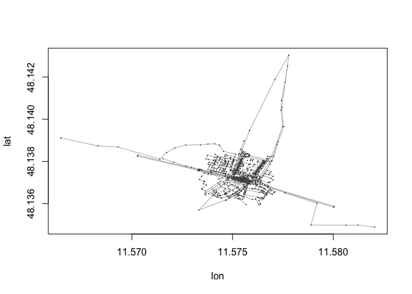
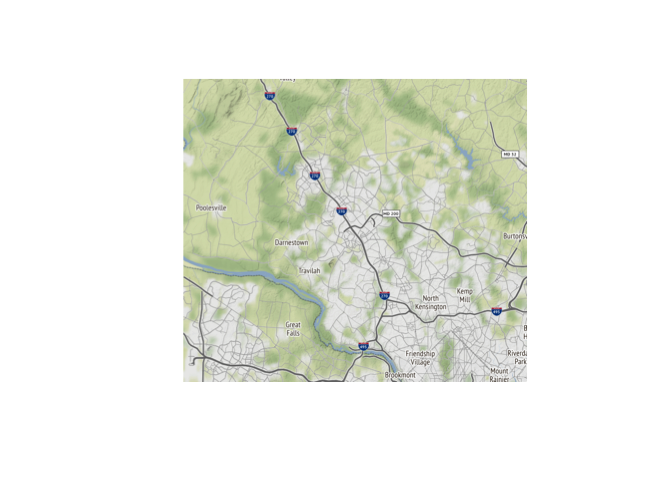
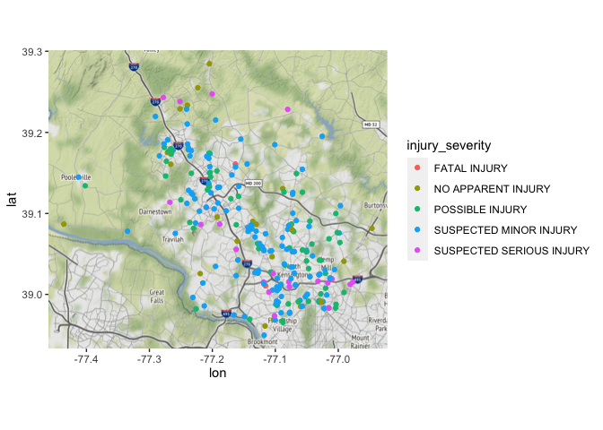
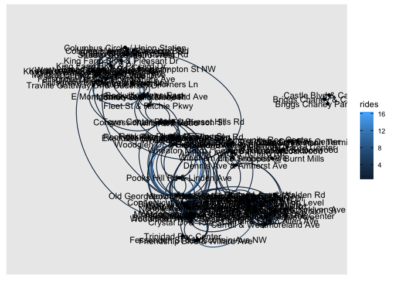

    library(tidyverse)

    ## ── Attaching packages ─────────────────────────────────────── tidyverse 1.3.0 ──

    ## ✓ ggplot2 3.3.2     ✓ purrr   0.3.4
    ## ✓ tibble  3.0.6     ✓ dplyr   1.0.4
    ## ✓ tidyr   1.1.2     ✓ stringr 1.4.0
    ## ✓ readr   1.4.0     ✓ forcats 0.5.0

    ## ── Conflicts ────────────────────────────────────────── tidyverse_conflicts() ──
    ## x dplyr::filter() masks stats::filter()
    ## x dplyr::lag()    masks stats::lag()

    `%notin%` <- Negate(`%in%`)

# Bikeshare Data Sources

## Dataset 1: Capital Bikeshare Stations via Montgomery Data

<https://data.montgomerycountymd.gov/Community-Recreation/Bikeshare/pdp9-g3gw>

API: <https://data.montgomerycountymd.gov/resource/pdp9-g3gw.json>

    library(jsonlite)

    ## 
    ## Attaching package: 'jsonlite'

    ## The following object is masked from 'package:purrr':
    ## 
    ##     flatten

    url <- "https://data.montgomerycountymd.gov/resource/pdp9-g3gw.json"

    bike_stations <- fromJSON(url)

## Dataset 2: Capital Bikeshare Ride Data via Capital Bikeshare

API documentation for live data:
<https://github.com/NABSA/gbfs/blob/master/gbfs.md>

For now I’ll look at static data

    rides <- read_csv("202101-capitalbikeshare-tripdata.csv")

    ## 
    ## ── Column specification ────────────────────────────────────────────────────────
    ## cols(
    ##   ride_id = col_character(),
    ##   rideable_type = col_character(),
    ##   started_at = col_datetime(format = ""),
    ##   ended_at = col_datetime(format = ""),
    ##   start_station_name = col_character(),
    ##   start_station_id = col_double(),
    ##   end_station_name = col_character(),
    ##   end_station_id = col_double(),
    ##   start_lat = col_double(),
    ##   start_lng = col_double(),
    ##   end_lat = col_double(),
    ##   end_lng = col_double(),
    ##   member_casual = col_character()
    ## )

## Dataset 3: Bike Routes and Trails

<http://bikemap.montgomerycountymd.gov/#>

But it doesn’t appear to be downloadable…

## Dataset 4: Bicylist Incident data

<https://data.montgomerycountymd.gov/Public-Safety/Crash-Reporting-Non-Motorists-Data/n7fk-dce5>

    url <- "https://data.montgomerycountymd.gov/resource/n7fk-dce5.json"

    bike_incidents <- fromJSON(url)

    dim(bike_incidents)

    ## [1] 1000   39

    bike_incidents <- bike_incidents %>%
      filter(pedestrian_type == "BICYCLIST")

## Dataset 5: Bike Routes

### from Google Maps

I don’t know that I’ll be able to download this data, but GoogleMaps has
a much more comprehensive and up-to-date map of bike lanes, bike trails,
and bike-friendly roads.

Biking trails The colors show you the type of bicycling paths.

Dark green: Trails that don’t have auto traffic. Green: Dedicated lanes
are roads that are shared with cars and have a separate bike lane.
Dotted green line: Bicycle friendly roads are roads that don’t have a
bike lane but are recommended for cyclists. Brown: Unpaved trails are
off-road dirt paths.

I do not think I can download this data, but I might be able to use it
as the foundation for a finished product? As long as volume is low it
won’t cost anything

### from OpenStreetMap

Perhaps less up to date, doesn’t include the Bike Friendly Roads
category, but is delightfully free and available to download. `{osmar}`
package helps to access the API

A spot check of the area around Rockville Town Center shows that the
data is reasonably up to date - and far more interpretable than the
datamontgomery map

    library(osmar)

    ## Loading required package: XML

    ## Loading required package: RCurl

    ## 
    ## Attaching package: 'RCurl'

    ## The following object is masked from 'package:tidyr':
    ## 
    ##     complete

    ## Loading required package: geosphere

    ## 
    ## Attaching package: 'osmar'

    ## The following object is masked from 'package:utils':
    ## 
    ##     find

    # yeah I don't even know how to approach spatial data. This is going to be a learning curve

    #sample data - Munich
    data(muc)
    plot(muc)

Getting cycleway data specifically:

from <http://overpass-turbo.eu/>

    /*
    This has been generated by the overpass-turbo wizard.
    The original search was:
    “cycleway=* or bicycle=*”
    */
    [out:json][timeout:25];
    // gather results
    (
      // query part for: “cycleway=*”
      node["cycleway"]({{bbox}});
      way["cycleway"]({{bbox}});
      relation["cycleway"]({{bbox}});
      // query part for: “bicycle=*”
      node["bicycle"]({{bbox}});
      way["bicycle"]({{bbox}});
      relation["bicycle"]({{bbox}});
    );
    // print results
    out body;
    >;
    out skel qt;

    cycleways_map <- fromJSON("export.json")

    cycleways_map <- cycleways_map$elements
    #seems to be comprised of nodes and ways data, but the ways are lacking from/to connections
    #left this unfinished...

packages for spatial data

-   {osmar} - openstreetmap data
-   {ggmap} - download and plot in ggplot style - expects dataframes
-   {sp} - introduces new object types for spatial data
-   {tmap} - quick thematic maps - ggplot syntax - expects spatial
    objects
    -   no scale functions, can layer data from multiple objects
    -   don’t define x and y, since those are inherit in sp
    -   quote variable names
    -   discrete color scales only
-   {raster} - for geodata split into cells or pixels, eg satellite
    image data

# Getting map data

    library(ggmap)

    ## Google's Terms of Service: https://cloud.google.com/maps-platform/terms/.

    ## Please cite ggmap if you use it! See citation("ggmap") for details.

    bike_incidents$latitude <- as.double(bike_incidents$latitude)
    bike_incidents$longitude <- as.double(bike_incidents$longitude)

    bbox <- make_bbox(bike_incidents$longitude, bike_incidents$latitude)

    map2 <- get_map(location = bbox, source = "osm", style = "toner")

    ## Source : http://tile.stamen.com/terrain/11/583/780.png

    ## Source : http://tile.stamen.com/terrain/11/584/780.png

    ## Source : http://tile.stamen.com/terrain/11/585/780.png

    ## Source : http://tile.stamen.com/terrain/11/586/780.png

    ## Source : http://tile.stamen.com/terrain/11/583/781.png

    ## Source : http://tile.stamen.com/terrain/11/584/781.png

    ## Source : http://tile.stamen.com/terrain/11/585/781.png

    ## Source : http://tile.stamen.com/terrain/11/586/781.png

    ## Source : http://tile.stamen.com/terrain/11/583/782.png

    ## Source : http://tile.stamen.com/terrain/11/584/782.png

    ## Source : http://tile.stamen.com/terrain/11/585/782.png

    ## Source : http://tile.stamen.com/terrain/11/586/782.png

    ## Source : http://tile.stamen.com/terrain/11/583/783.png

    ## Source : http://tile.stamen.com/terrain/11/584/783.png

    ## Source : http://tile.stamen.com/terrain/11/585/783.png

    ## Source : http://tile.stamen.com/terrain/11/586/783.png

    plot(map2)

    ggmap(map2) +
      geom_point(data = bike_incidents, aes(x = longitude, y = latitude, color = injury_severity)) 

    ggsave("injuries_by_location.png")

    ## Saving 7 x 5 in image

# Network map of bikeshare rides

    library(lubridate)

    ## 
    ## Attaching package: 'lubridate'

    ## The following objects are masked from 'package:base':
    ## 
    ##     date, intersect, setdiff, union

    library(tidygraph)

    ## 
    ## Attaching package: 'tidygraph'

    ## The following object is masked from 'package:stats':
    ## 
    ##     filter

    library(ggraph)
    library(reclin)

    ## Loading required package: lvec

    ## 
    ## Attaching package: 'lvec'

    ## The following object is masked from 'package:RCurl':
    ## 
    ##     clone

    ## The following object is masked from 'package:base':
    ## 
    ##     order

    ## Loading required package: ldat

    ## Loading required package: Rcpp

    ## 
    ## Attaching package: 'ldat'

    ## The following objects are masked from 'package:base':
    ## 
    ##     append, match, table, which

    ## 
    ## Attaching package: 'reclin'

    ## The following object is masked from 'package:base':
    ## 
    ##     identical

    library(igraph)

    ## 
    ## Attaching package: 'igraph'

    ## The following object is masked from 'package:tidygraph':
    ## 
    ##     groups

    ## The following objects are masked from 'package:lubridate':
    ## 
    ##     %--%, union

    ## The following objects are masked from 'package:dplyr':
    ## 
    ##     as_data_frame, groups, union

    ## The following objects are masked from 'package:purrr':
    ## 
    ##     compose, simplify

    ## The following object is masked from 'package:tidyr':
    ## 
    ##     crossing

    ## The following object is masked from 'package:tibble':
    ## 
    ##     as_data_frame

    ## The following objects are masked from 'package:stats':
    ## 
    ##     decompose, spectrum

    ## The following object is masked from 'package:base':
    ## 
    ##     union

    rides_jan2021 <- rides

    rides_jan2021$started_at <- as_datetime(rides_jan2021$started_at)
    rides_jan2021$ended_at <- as_datetime(rides_jan2021$ended_at)

    rides_jan2021$duration <- difftime(rides_jan2021$ended_at, rides_jan2021$started_at, units = "mins")

    all_stations <- rides_jan2021 %>%
      select(start_station_name, start_station_id) %>%
      distinct() %>%
      rename(name = start_station_name)

    #station names don't match exactly - use reclin to match pairs

    possible_pairs <- pair_blocking(all_stations,bike_stations) %>%
      compare_pairs(by=c("name"),default_comparator = jaro_winkler()) %>%
      score_problink() %>%
      select_n_to_m() %>%
      link(all_x = F,all_y=F) 

    ## Warning: `group_by_()` is deprecated as of dplyr 0.7.0.
    ## Please use `group_by()` instead.
    ## See vignette('programming') for more help
    ## This warning is displayed once every 8 hours.
    ## Call `lifecycle::last_warnings()` to see where this warning was generated.

    #filter to just the moco stations
    stations <- possible_pairs %>%
      filter(name.y %in% bike_stations$name) %>%
      rename(name = name.x,
             moco_name = name.y) %>%
      mutate(coords = the_geom$coordinates) %>%
      mutate(lng = unlist(coords)[c(T,F)],
             lat = unlist(coords)[c(F,T)]) %>%
      select(name, lat, lng)

    #limit to stations where Start AND End are in MoCo
    rides_jan2021 <- rides_jan2021 %>%
      filter(start_station_name %in% stations$name) %>%
      filter(end_station_name %in% stations$name)

    #ends with 1170 rides in January. That's more like it!

# network graph

    rides_network <- rides_jan2021 %>%
      group_by(start_station_name,end_station_name) %>%
      summarise(rides = n()) %>%
      ungroup()

    ## `summarise()` has grouped output by 'start_station_name'. You can override using the `.groups` argument.

    #it no worky
    graph_rides <- graph.data.frame(rides_network, directed = T, vertices = stations)

    #pins the layout as a matrix
    lo <- layout.norm(as.matrix(stations[,2:3]))

    graph_rides %>%
      ggraph(layout = lo) +
        geom_edge_arc0(aes(color = rides), arrow = arrow(length = unit(2,"mm")),
                       end_cap = circle(5,"mm")) +
        geom_node_point() +
      geom_node_text(aes(label = name)) + 
      coord_flip()

    ## Warning: Ignoring unknown parameters: end_cap

    ggsave("network_draft.png", width = 13, height = 7)

# network graph ON A MAP

IT IS POSSIBLE

<https://rpubs.com/debasishb/298685>

    ## SAMPLES
    ggmap(map, fullpage = TRUE,base_layer = ggraph(flights) ) +
      geom_edge_arc(aes(
        edge_size=E(flights)$Frequency),
        edge_colour = 'yellow', 
        edge_alpha = 0.5,
        curvature = 0.2,
        arrow=a,
        end_cap = circle(.008, 'inches')) +
      geom_node_point(aes(colour = closeness_centrality,size=betweenness_centrality)) +
      scale_colour_gradientn(colours=rainbow(3))+scale_size_continuous(range = c(1, 10))

    ggmap(map2) +
      geom_point(data = bike_incidents, aes(x = longitude, y = latitude, color = injury_severity)) 

    ##

    ## THIS IS WHERE I LEFT OFF. NEED TO REVISE THE BELOW TO MATCH THE RPUBS DOC

    a <- arrow(type = "closed", length = unit(.09, "inches"))

    ggraph(graph_rides, layout = lo) +
          geom_edge_link(aes(alpha = rides)) +
      geom_node_point() +
      geom_node_text(aes(label = name)) +
      coord_flip() +
      map2
